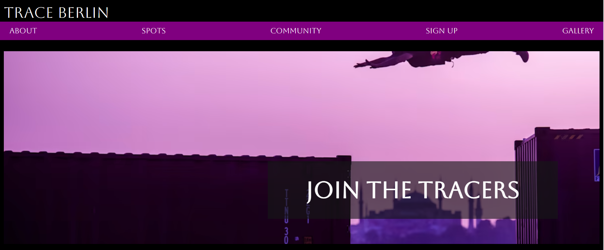
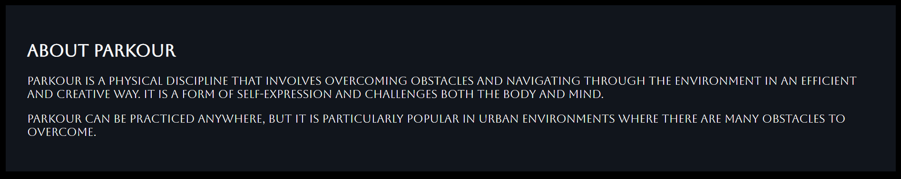
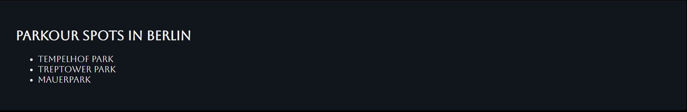
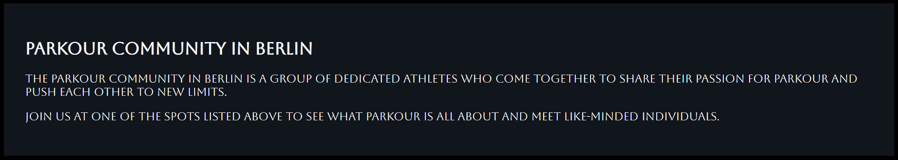
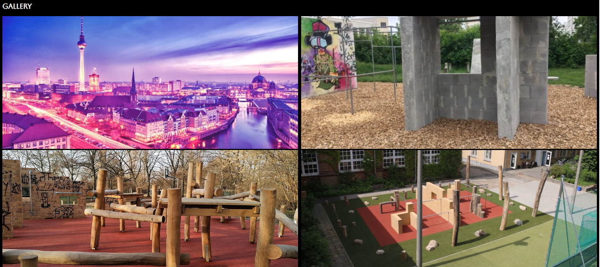

# project-portfolio-trace

Trace Berlin

Our mission for this website is to bring together parkour enthusiasts from all over the Berlin to share their passion, skills and knowledge. We aim to create a welcoming and inclusive environment where anyone can come to meet new friends, explore new training spots, and improve their skills. Whether you're a seasoned pro or just starting out, we have something for everyone. 

## Features 

__Navigation Bar__

- A fixed position navigation bar takes the user to the About, Spots, Community, Sign up, and gallery sections on the site. The buttons are fully responsive and practical. 

__The landing page image__

 - An image of an athlete performing a (kong leap) onto a container, with text overlay to motivate the visitors for joining the community.  

 

__About section__

- Short decription of parkour and where it is recommended to train. 

__Spots section__

- Examples of popular spots for tracers (athletes) to give an idea of what to expect from the recommendations. 

__Community section__ 

- Short description of what the parkour community is and how this site aims to strengthen the parkour community in Berlin.

__Gallery section__

- The gallery has images to some of the spots that will be shared with the community to visit and train at. 

__Sign Up section__ 

- This section will allow the user to get signed up to the Trace Berlin community.

- The required inputs are first name, last name, and email address. 

__The Footer__

- The footer section includes links to social media home pages. 

__Testing__

- I used chrome developer tools to check how the site looks on different devices and screen sizes while maintaining it's practivality. 

__Validator Testing__

- HTML
  - No errors were returned when passing through the official [W3C validator](https://validator.w3.org/nu/#textarea)
- CSS
  - No errors were found when passing through the official [(Jigsaw) validator](https://jigsaw.w3.org/css-validator/validator)

__Deployment__

The site was deployed to GitHub pages. The steps to deploy are as follows:

- In the GitHub repository, navigate to the Settings tab
- From the source section drop-down menu, select the Master Branch
- Once the master branch has been selected, the page will refresh with a - - detailed ribbon display to indicate the successful deployment.

__Credits__

I used two lines of code by Tim Wells to allign images and keep them responsive in different screen sizes: https://timnwells.medium.com/create-a-simple-responsive-image-gallery-with-html-and-css-fcb973f595ea

__Content__

The paragraphs in site were written by me, through my understanding of parkour and what the community will be like.

The icons in the footer were taken from Font Awesome

__Media__

- I used an image from the official Red Bull website as the top background image, and images from Google Maps for spots in the Gallery section. 

